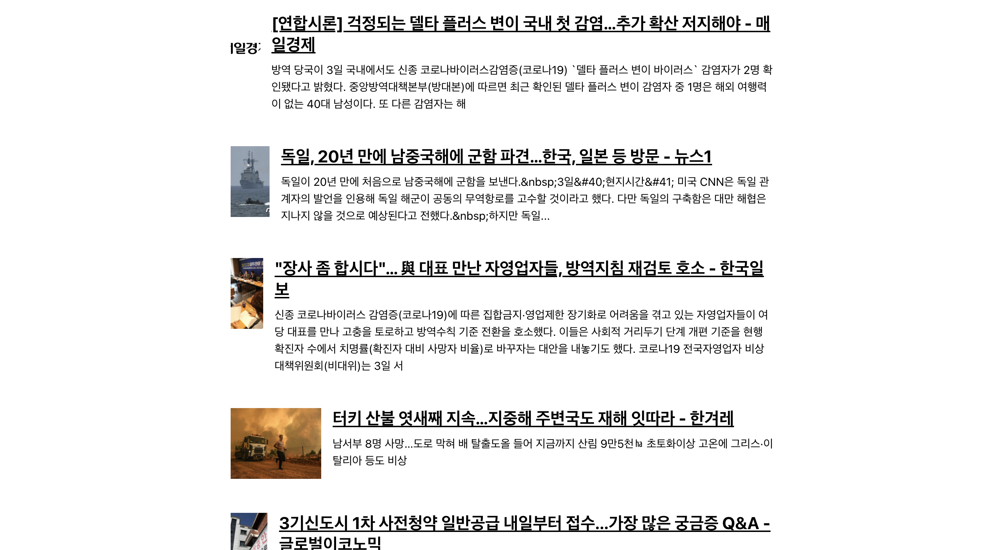
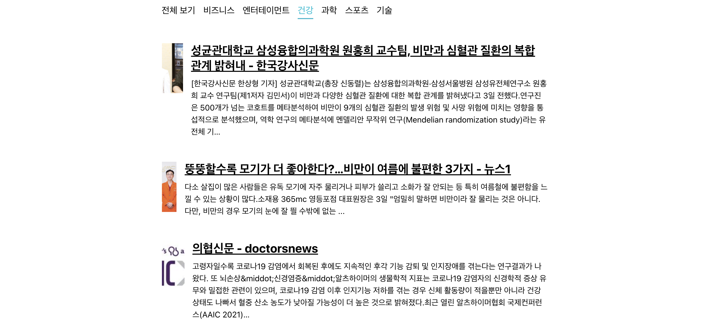

# News-Viewer

## Axios + async / await

## React Router

<br>

### 1. Axios.get news articles

<br>

> <br>
>
> ```
> const fetchData = async () => {
>  setLoading(true);
>
>  try {
>    const response = await axios.get(
>      'https://newsapi.org/v2/top-headlines?country=kr&apiKey={myAPIKey}',
>    );
>    setArticles(response.data.articles);
>  } catch(e) {
>    console.log(e);
>  }
>  setLoading(false);
> };
> fetchData();
> ```
>
> <br>
> map() 함수를 사용해 기사들을 렌더링 하기
> <br> <br>
>
> ```
> <NewsListBlock>
>  {articles.map(article=> (
>    <NewsItem key={article.url} article={article}/>
>  ))}
> </NewsListBlock>
> ```
>
> <br>

<br>

### 초기 화면

<br>


<br>

### 2. Get articles based on selected category

<br>

> <br>
> 부모 컴포넌트로 부터 category와 카테고리를 변경하기 위한 onSelect()를 Prop로 받는다.
> <br> <br>
>
> ```
> <Category
>  key={c.name}
>  active={category === c.name}
>  onClick={() => onSelect(c.name)}>
>  {c.text}
> </Category>
> ```
>
> {css} from 'styled-component 를 사용해 active된 prop에 스타일을 입힌다.
> <br>
>
> ```
> ${props =>
>  props.active && css`
>    font-weight: 600;
>    border-bottom: 2px solid #22b8cf;
>    color: #22b8cf;
>    &:hover {
>      color : #3bc9db;
>    }
>  `
> }
> ```
>
> props로 받은 category를 이용해 쿼리를 만든다.
> <br> <br>
> `을 이용해 선택된 카테고리가 적용된 articles을 받아올 수 있는 url을 만들어 요청한다.
>
> ```
> try {
>  const query = category === 'all' ? '': `&category=${category}`;
>  const response = await axios.get(
>    `https://newsapi.org/v2/top-headlines?country=kr${query}&apiKey={myAPIKey}`,
>  );
>  setArticles(response.data.articles);
> }
> ```
>
> <br>

<br>

### 네비게이션 적용 화면

<br>


<br>
