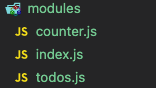

# React + Redux

### 1. redux + react-redux

<br>

> npm install redux react-redux
> <br>
> npm install redux-actions
> <br>
> npm install immer

<br>

### 2. Ducks Pattern

<br>



<br>

> [Ducks pattern] <br>
> 액션 타입, 액션 생성 함수, 리듀서 함수를 기능별로 한 파일에 몰아서 작성하는 방식
> <br>
>
> [ 액션 타입 선언 ]
>
> ```
> const INCREASE = 'counter/INCREASE';
> const DECREASE = 'counter/DECREASE';
> ```
>
> [ 액션 생성 함수 ]
>
> ```
> export const increase = () => ({ type: INCREASE });
> export const decrease = () => ({ type: DECREASE });
> ```
>
> [ 리듀서 함수 ]
>
> ```
> const initialState = {
>  number: 0,
> };
> // initial state
>
> function counter(state = initialState, action) {
>  switch (action.type) {
>    case INCREASE:
>      return {
>        number: state.number + 1,
>      };
>    case DECREASE:
>      return {
>        number: state.number - 1,
>      };
>    default:
>      return state;
>  }
> }
>
> export default counter;
> ```
>
> <br>

<br>

### 3. combineReducer + bindActionCreators

<br>

> [ combineReducer ] <br>
>
> ```
> const rootReducer = combineReducers({
>  counter,
>  todos,
> });
> ```
>
> [ bindActionCreators]
>
> ```
> export default connect(
>  state => ({
>    number: state.counter.number,
>  }),
>  dispatch => bindActionCreators(
>  {
>    increase,
>    decrease,
>  }, dispatch
>  )
> )(CounterContainer);
> ```
>
> [ connect의 두번째 파라미터를 이용한 또 다른 방법 ]
>
> ```
> export default connect(
>  state => ({
>    number: state.counter.number,
>  }),
>  {
>    increase,
>    decrease,
>  },
> )(CounterContainer);
> ```
>
> <br>

<br>

### 4. redux-actions

<br>

> [createAction] <br>
> 객체를 직접 만들어 줄 필요 없이 액션 생성 함수를 선언할 수 있다.
>
> ```
> export const increase = createAction(INCREASE);
> export const decrease = createAction(DECREASE);
> ```
>
> [handleActions] <br>
> 함수의 첫번째 파라미터에는 각 액션에 대한 업데이트 함수를 넣어주고, 두 번째 파라미터에는 초기 상태를 넣어준다.
> <br> <br>
> 이를 이용해 가독성 높은 리듀서 함수를 작성할 수 있다.
>
> ```
> const counter = handleActions(
>  {
>    [INCREASE]: (state, action) => ({ number: state.number + 1 }),
>    [DECREASE]: (state, action) => ({ number: state.number - 1 }),
>  },
>  initialState,
> );
> ```
>
> <br>

<br>

### 5. Immer

<br>

> [produce from immer] <br> <br>
> immer를 이용해 deps가 깊은 데이터의 불변성을 유지하며 상태관리를 처리한다.
>
> ```
> const todos = handleActions(
>  {
>    // 객체 비구조화 할당 문법을 사용해 payload가 가지는 값을 명시
>    [CHANGE_INPUT]: (state, { payload: input }) =>
>      produce(state, (draft) => {
>        draft.input = input;
>      }),
>    [INSERT]: (state, { payload: todo }) =>
>      produce(state, (draft) => {
>        draft.todos.push(todo);
>      }),
>    [TOGGLE]: (state, { payload: id }) =>
>      produce(state, (draft) => {
>        const todo = draft.todos.find((todo) => todo.id === id);
>        todo.done = !todo.done;
>      }),
>    [REMOVE]: (state, { payload: id }) =>
>      produce(state, (draft) => {
>        const index = draft.todos.findIndex((todo) => todo.id === id);
>        draft.todos.splice(index, 1);
>      }),
>  },
>  initialState,
> );
> ```
>
> <br>

<br>

### 6. useSelector + useDispatch

<br>

> [useSeletor] <br> <br>
> 해당 hook을 사용해 리덕스의 상태를 조회할 수 있다.
>
> ```
>  const { input, todos } = useSelector(({ todos }) => ({
>    input: todos.input,
>    todos: todos.todos,
>  }));
> ```
>
> <br>
> [useDispatch] <br> <br>
> 해당 hook을 사용해 컴포넌트 내부에서 스토어의 내장 함수 dispatch를 사용할 수 있다.
> <br> <br>
>
> ```
> const dispatch = useDispatch();
> const onChangeInput = useCallback(() => dispatch(changeInput(input)), [
>  dispatch,
> ]);
> const onInsert = useCallback((text) => dispatch(insert(text)), [dispatch]);
> const onToggle = useCallback((id) => dispatch(toggle(id)), [dispatch]);
> const onRemove = useCallback((id) => dispatch(remove(id)), [dispatch]);
> ```
>
> <br> 이때 useCallback을 이용해 컴포넌트의 성능을 최적화 해줄 수 있도록 한다.
> <br> <br>
