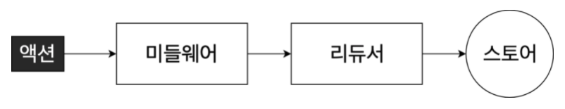
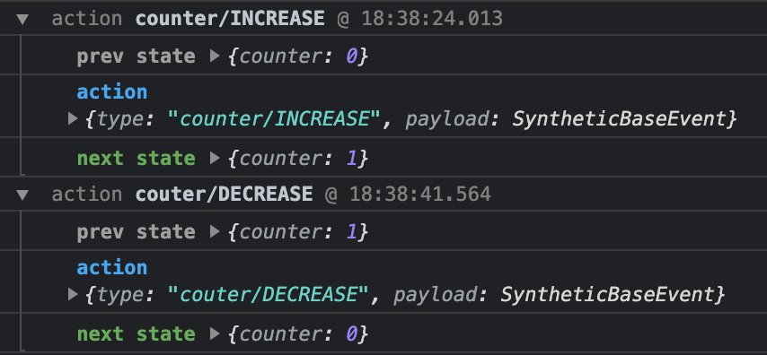

# Redux MiddleWare

### npm install package

> npm install redux-logger
> npm install redux-thunk
> npm install axios

### MiddleWare



> 리덕스 미들웨어를 사용할 경우 액션이 디스패치 된 뒤, 리듀서에서 해당 액션을 받아와 업데이트 하기전에 추가적인 작업을 할 수 있다.
> <br> <br>
> 추가적인 작업의 종류
> <br>
>
> - 특정 조건에 따라 액션을 무시
> - 액션을 콘솔로 출력하거나, 서버쪽에 로깅
> - 액션이 디스패치 됐을 때 이를 수정해 리듀서에 전달
> - 특정 액션이 발생했을 때 이에 기반하여 다른 액션을 발생
> - 특정 액션이 발생했을 떄 특정 자바스크립트 함수를 실행
>
> 출처 : https://react.vlpt.us/redux-middleware/

<br>

### 1. redux-logger

<br>



> <br>
> 액션이 디스패치 되기전 상태와 후의 상태를 콘솔에 남겨주는다.
> <br> <br>
>
> ```
> import { createLogger } from "redux-logger";
>
> const logger = createLogger();
> const store = createStore(rootReducer, applyMiddleware(logger));
> ```
>
> store를 생성할 때, applyMiddleware()함수를 함께 넣어준다.
> <br> <br>

<br>

### 2. redux-thunk

<br>

> 액션 타입과 API를 요청하는 함수를 파라미터로 받아 작업을 처리해주는 thunk 함수 생성
> <br> <br>
>
> ```
> export default function createRequestThunk(type, request) {
>  const SUCCESS = `${type}_SUCCESS`;
>  const FAILURE = `${type}_FAILURE`;
>
>  return (params) => async (dispatch) => {
>    dispatch({ type });
>    dispatch(startLoading(type));
>    try {
>      const response = await request(params);
>      dispatch({
>        type: SUCCESS,
>        payload: response.data,
>      });
>      dispatch(finishLoading(type));
>    } catch (e) {
>      dispatch({
>        type: FAILURE,
>        payload: e,
>        error: true,
>      });
>      dispatch(finishLoading(type));
>      throw e;
>    }
>  };
> }
> ```
>
> loading 상태를 관리하는 리덕스 모듈을 추가해 특정 액션이 디스패치될 때 마다 로딩 상태를 변경해주는 작업 또한 처리
> <br>
