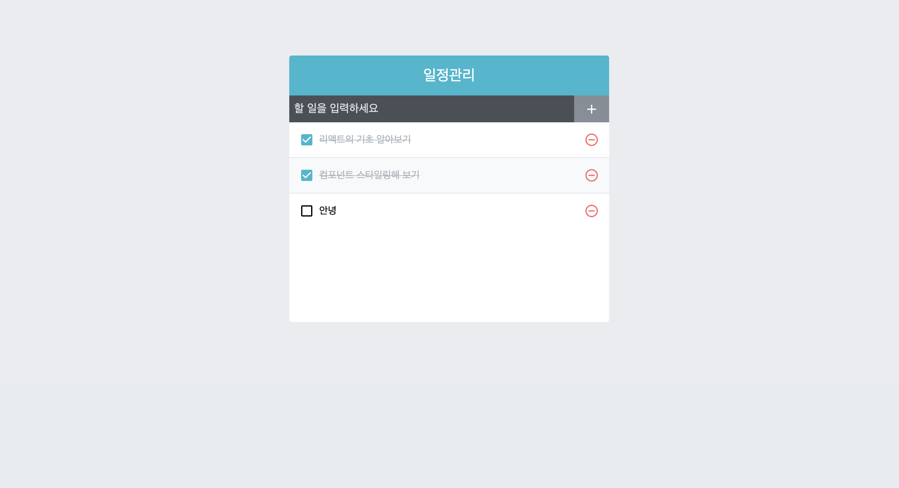

# Todo-app

## Components

> TodoTemplate : 화면의 가운데서 일정관리를 보여주며, Children으로 내부 JSX를 props로 받아와서 렌더링하는 컴포넌트

> TodoInsert : 새로운 항목을 입력하고 추가할 수 있는 컴포넌트.
>  
> state를 통해 인풋의 상태를 관리한다.

> TodoList : todos 배열을 props로 받아 온 후, map 함수를 사용해 여러개의 TodoListItem 컴포넌트로 변환하여 보여주는 컴포넌트

> TodoListItem : 각 할 일 항목에 대한 정보를 보여주는 컴포넌트
>  
> todo 객체를 props로 받아와서 상태에 따라 다른 UI를 보여준다.

 

## 기능

> onInsert : 새로운 할 일을 추가하는 함수
>  
> onRemove : 등록한 할 일을 삭제하는 함수
>  
> onToggle : 할 일의 완료 여부를 변경하는 함수

 

</img>
 

## React 개발 사용 아이콘

 

> react-icon : [react-icon](https://react-icons.netlify.com/, "react-icon")
